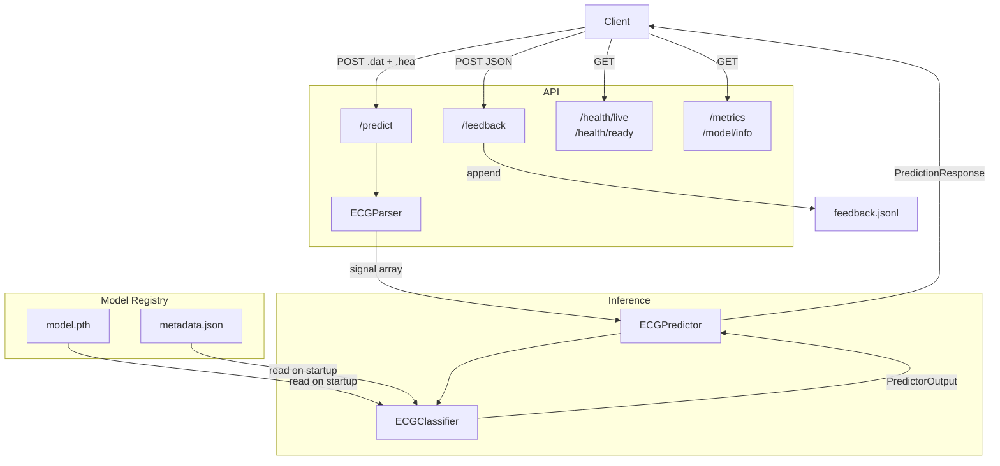

# Chagas-ECG-Net

[](https://www.python.org/downloads/release/python-31115/)
[](https://YOUR_CLOUD_RUN_URL)

Chagas disease affects approximately 6–7 million people worldwide, with most cases concentrated in Latin America. Diagnosis through electrocardiographic (ECG) analysis is a common clinical approach, but requires specialist interpretation that is not always available in endemic regions.

Chagas-ECG-Net is a production-ready REST API for automated Chagas disease classification from 12-lead ECG signals. It serves a Grouped-Lead CNN trained on SaMi-Trop and PTB-XL data, achieving 99.75% accuracy and perfect Chagas recall on the held-out test set. The API is built with FastAPI and PyTorch, containerized with Docker, and deployed on GCP Cloud Run (WIP).

---

## Architecture Diagram



---

## Quick Start

### Access API through cloud

The API is live at [chagas-ecg-net](https://chagas-ecg-net-133719626866.europe-west2.run.app). `/docs` has exploration to run anything locally.

### Build and serve locally

#### 1. Clone Repository

In a terminal from the directory in which the project will be located, use the following command.

```bash
git clone https://github.com/figredos/chagas-ecg-net.git
```

#### 2. Install project as package

Before running, make sure to create a virtual environment and install the project as a package.

##### 2.1 Create .venv

```bash
python3 -m venv .venv
```

##### 2.2 Install project

```bash
# Only for API usage
pip install -e .

# For full development
pip install "[.dev]"
```

#### 3. Serve

There are two possibilities for serving the project, either locally, or through the docker file (WIP).

##### Serving Locally

To serve locally, use the makefile through

```bash
make serve
```

##### Serving with Docker

To serve via docker, build the container and bring it online. All of which can be done easily through the make file.

```bash
# Builds image
make docker-build

# Takes API live
make docker-up

# Takes API down
make docker-down
```

### 4. Accessing API

Once all of the steps above have been performed, the API can be accessed through the URL http://127.0.0.1:8000.

---

## Model comparison

The available models, and their respective metrics are as follows:

### Model-Level Metrics

| Model Name         | Inference Time (ms) | Accuracy | Active Predictor | Number of Params |
| ------------------ | ------------------- | -------- | ---------------- | ---------------- |
| _Pre-Norm Encoder_ | 3057.64             | 0.9270   | ❌               | 1,271,426        |
| _Swin Transformer_ | 3304.6334           | 0.8185   | ❌               | 424,038          |
| _CNN-BERT_         | 8280.8094           | 0.9868   | ❌               | 1,054,817        |
| _Grouped-Lead CNN_ | 2247.4647           | 0.9975   | ✅               | 2,006,466        |

### Per-class Metrics

| Model Name         | Class      | F1-Score | Recall | Precision |
| ------------------ | ---------- | -------- | ------ | --------- |
| _Pre-Norm Encoder_ | non-Chagas | 0.9262   | 0.9185 | 0.9342    |
|                    | Chagas     | 0.9277   | 0.9355 | 0.9200    |
|                    | -          | -        | -      | -         |
| _Swin Transformer_ | non-Chagas | 0.7854   | 0.8411 | 0.8123    |
|                    | Chagas     | 0.8516   | 0.7987 | 0.8243    |
|                    | -          | -        | -      | -         |
| _CNN-BERT_         | non-Chagas | 0.9908   | 0.9830 | 0.9869    |
|                    | Chagas     | 0.9828   | 0.9907 | 0.9868    |
|                    | -          | -        | -      | -         |
| _Grouped-Lead CNN_ | non-Chagas | 0.9951   | 1.0000 | 0.9975    |
|                    | Chagas     | 1.0000   | 0.9951 | 0.9976    |
|                    |            |          |        |           |

---
