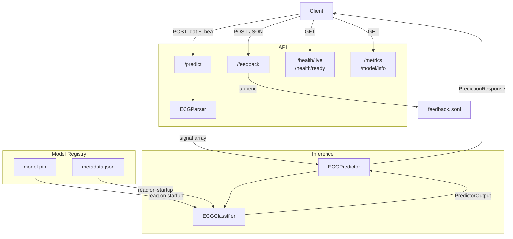
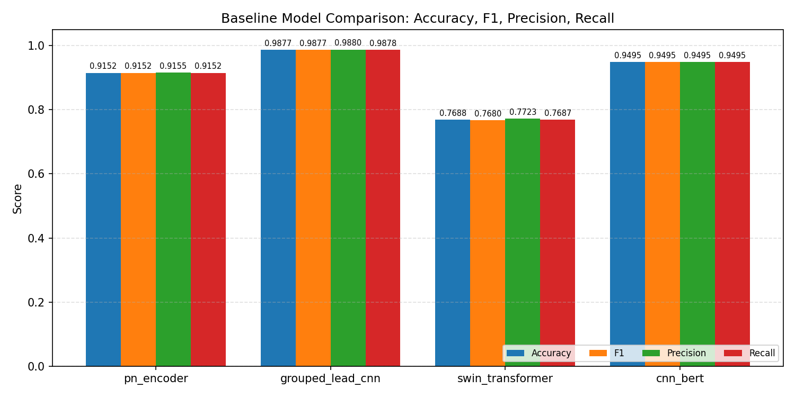

# Chagas-ECG-Net API Architecture

## System Overview

The Chagas-ECG-Net API is a production inference service for classifying ECG signals as Chagas or non-Chagas. It is composed of 3 layers.

- **_API Layer_**: The API layer exposes 6 endpoints
  - `POST /predict` is the primary endpoint. It accepts a **WFDB** file pair (`.dat` + `.hea`), parses them into a signal array with the `ECGParser` class, passes the parsed signal through the predictor, and returns a `PredictionResponse` (predicted class, confidence, class probabilities, model name, model version, and inference time).
  - `POST /feedback` accepts corrections to previous predictions and appends them as JSON lines to a local JSONL file for future retraining.
  - `GET /health/live` and `GET /health/ready` are for readiness and liveness checks.
  - `GET /metrics` exposes request counts and latency statistics.
  - `GET /model/info` returns the metadata of the currently loaded model.

- **_Inference Layer_**: And `ECGPredictor` class that wraps any model inheriting from `ECGClassifier`. It receives a raw signal array, converts it to a tensor, and calls the model's `predict` method. Each model has its own implementation of the `_format_data` function, which transforms the raw signal into whatever shape the architecture expects before the forward pass.

- **_Model Registry_**: A local directory structure storing trained model artifacts. Each model has a versioned subdirectory containing `model.pth` (the model's state dict) and `metadata.json` (architecture config, dataset kwargs, class names, and evaluation metrics). At startup `load_model_from_registry` reads both files, reconstructs the model from its constructor kwargs, loads the weights, and hands the initialized model to `ECGPredictor`.

## API Diagram

## Model Architecture

The primary model the API serves is a _Grouped-Lead CNN_, a convolutional architecture designed specifically for 12-lead ECG classification. Rather than treating all 12 leads as a single undifferentiated input, it groups them into anatomically meaningful groups:

- Inferior leads
- Lateral leads
- Septal leads
- Anterior leads

Independent convolutional filters are applied to each of the groups of leads, before combining their representations. This mirrors standard clinical practice, where cardiologists interpret leads in regional groups rather than in isolation, making the inductive bias of the architecture well-aligned with the structure of the ECG signal.

This design allows the Grouped-Lead CNN model to deal better on small datasets when compared with other models. By constraining each filter to operate within a lead group, the model has significantly fewer parameters to learn than architectures that process all 12 leads jointly, such as the other architectures built for this problem (Pre-Norm Transformer Encoder, Swin Transformer, CNN-BERT).

Training was performed on a combined dataset of SaMi-Trop and PTB-XL samples, $3262$ of shape $12, 734$. The Grouped-Lead CNN achieved the best balance of accuracy and recall, outperforming the other three architecture. The CNN-BERT hybrid came closest in performance, but showed weaker recall on the Chagas class, which for a medical classification task, where false negatives carry real clinical risk, is considered a critical failure.

